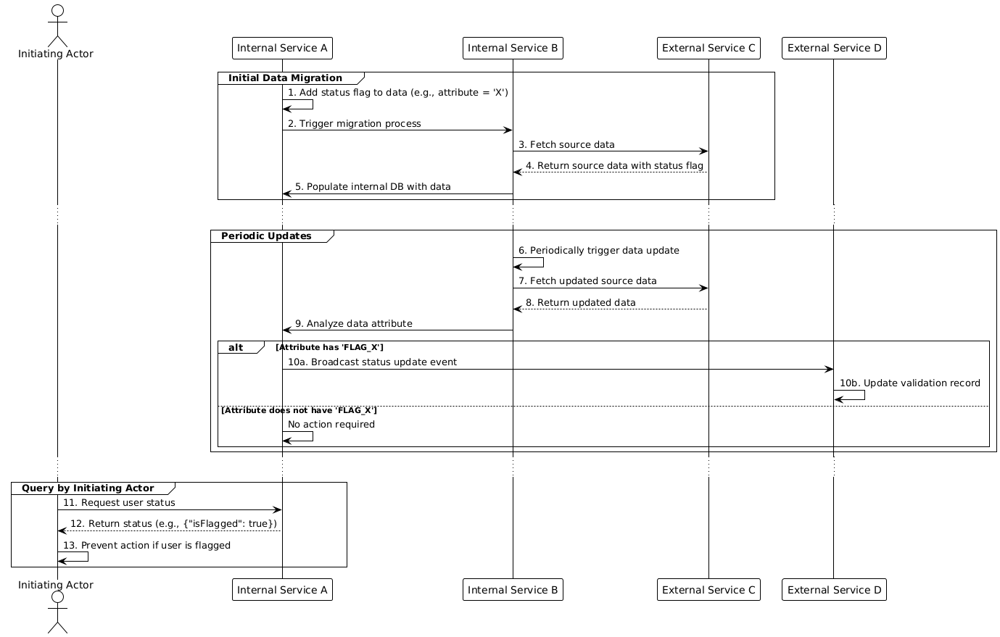

# karenharutyunyan
# Digital Transformation - Data Flagging Workflow



## 📚 Project Overview

This repository contains UML sequence diagrams, data process definitions, and supporting artifacts for a digital transformation initiative focused on **data flagging, migration, and validation workflows**.

These diagrams illustrate:
- Initial data migration flows with attribute flagging (e.g., setting `FLAG_X` on datasets).
- Periodic data update checks and broadcast events.
- Real-time user queries to enforce business rules based on flagged data.

Used to support system modernization efforts, onboarding of new developers, and stakeholder process discussions.

---

## 🔍 Sequence Diagram

### Initial Migration, Periodic Updates, and Query Handling
The sequence diagram (`sequence-diagram.png`) captures multi-service interactions:

- **Internal Services** handle data preparation, DB population, periodic updates, and validation triggers.
- **External Services** provide source data and accept validation records.
- The **Initiating Actor** performs status queries to ensure business logic enforcement.

> ✅ Improves transparency and speeds up technical onboarding by making distributed system interactions clear.

---

## 🗂️ Repository Structure

```bash
.
├── sequence-diagram.png      # UML Sequence Diagram (rendered on this page)
├── diagrams/
│   └── sequence-diagram.drawio   # Editable source file (draw.io format)
├── docs/
│   └── process.md             # Detailed textual process descriptions
└── README.md                  # This file
